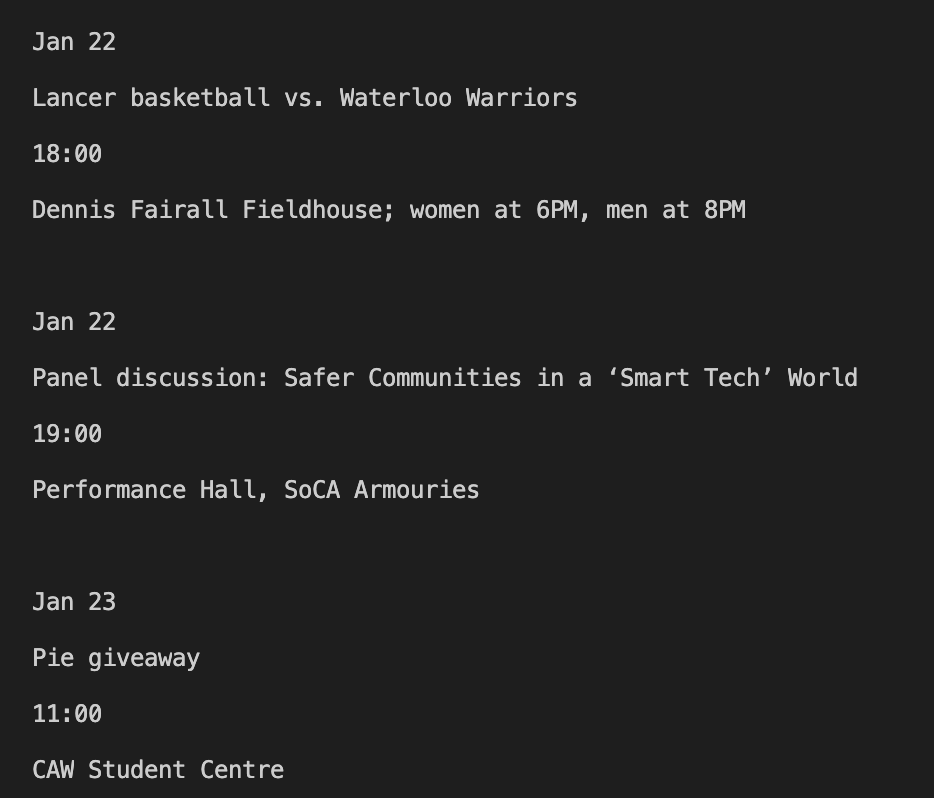

# UWindsor-Upcoming-Event-Finder
A python script that displays the date, description, time, and location of upcoming events of the week, and asks the user to enter any specific dates they wish to see.

